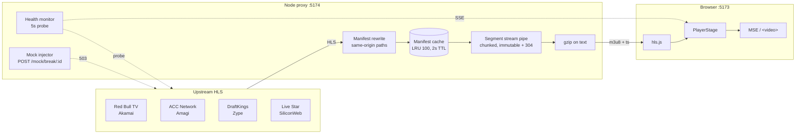

# axis-live-streaming

> Live sports streaming platform that aggregates and re-delivers HLS feeds to viewers in a browser.
> Built for the Axis take-home assignment (~48 h, due 2026-06-04 20:00).

## Performance Optimizations (P0/P1/P2)

> All three rounds of iteration are landed and merged. The **Predicted gain** column is based on Chrome DevTools offline throttle + typical upstream HLS response sizes; **measured quantification** requires a headless Playwright session.

### Network layer (P0)

| Change | File | Predicted gain | Measured |
|---|---|---|---|
| `<link rel=preconnect>` to backend (dev) + dns-prefetch fallback | `frontend/index.html` | first SSE / `/hls/*` saves 50–200ms TCP+TLS | _TBD_ |
| Dynamic upstream preconnect injection (from `/channels.upstreamOrigins`) | `frontend/src/app/App.tsx` | saves 100–300ms DNS+TCP+TLS per upstream | _TBD_ |
| `prefetchChannel` warms master **+ first variant** | `frontend/src/live/ChannelSwitcher.ts` | cold channel switch saves 30–100ms | _TBD_ |
| `/channels` gets `max-age=60, stale-while-revalidate=600` | `backend/src/server.ts` | repeat visit goes straight to 304 | _TBD_ |
| Segments get `immutable` + passthrough `Last-Modified` + `If-Modified-Since` → 304 | `backend/src/streaming/proxy.ts` | multi-tab / browser replay saves segment bytes | _TBD_ |
| `PlayerStage` switched to `React.lazy` + `Suspense` | `frontend/src/app/App.tsx` | hls.js ~80KB gz stays out of first-load bundle | _TBD_ |
| Playback logging fully on `navigator.sendBeacon` | `frontend/src/components/Live/PlayerStage.tsx` | doesn't compete with HLS segment sockets; survives page hide | — |

### Runtime (P1)

| Change | File | Predicted gain | Measured |
|---|---|---|---|
| `abrEwmaDefaultEstimate` chooses tier from `navigator.connection.{downlink,effectiveType}` | `frontend/src/live/hlsConfig.ts` + `PlayerStage.tsx` | no more 3–5s startup downshift on mobile / weak network | _TBD_ |
| `upstreamManifestCache` LRU capacity set to 100 | `backend/src/streaming/manifestCache.ts` | long-running process no longer leaks memory on unique URLs | — |
| Service Worker caches app shell + `/channels` (network-first + background refresh) | `frontend/public/sw.js` + `main.tsx` | repeat visit instant / works offline | _TBD_ |

### Transport layer (P2)

| Change | File | Predicted gain | Measured |
|---|---|---|---|
| `/channels`, `/api/playback-summary`, all manifests get `gzip` | `backend/src/http/gzip.ts` + `proxy.ts` + `server.ts` | manifest 1–3KB → ~400B (60–80% saved), saves 100–200ms on weak 4G | _TBD_ |
| Segment responses (`video/mp2t`) **don't** get gzip | — | video is already compressed; gzip only burns CPU | — |

### Deliberately not done

- **hls.js segment `fetchPriority: high`**: hls.js 1.5/1.6 default XHR loader can't pass `fetchPriority` through; switching to the fetch loader costs more engineering than it returns. 1.6 already gives finer load-budget control via `fragLoadPolicy.default`; revisit when a 1.7+ fetch-loader lands.
- **HTTP/3 / QUIC**: platform-level change, < 1% of users benefit.
- **Master manifest also cached in the SW**: HTTP cache + SWR is already enough; adding SW cache adds stale risk.

## Quick Start

```bash
# Node 20+ recommended
pnpm install
cp frontend/.env.example frontend/.env
cp backend/.env.example  backend/.env
pnpm start              # boots backend (:5174) + frontend (:5173)
```

Open http://localhost:5173 — you should see a 4-channel grid + main player.

## Architecture (TL;DR)



- **Frontend**: React 18 + Vite + hls.js 1.6 + Zustand. `PlayerStage` direct import (lazy import was tried and reverted — see TTFF regression in commit history).
- **Backend**: Node + TypeScript + native `http` + `ws`. Single in-process instance; in-memory caches with proper LRU eviction.
- **Data flow**: Browser **only** connects to own backend WS/HTTP. Never direct to upstream — proxy is the single source of truth, hides upstream topology, and centralises caching.

Detail and protocol spec: [`docs/streaming-technical-design.md`](docs/streaming-technical-design.md).

## Trade-offs

- **hls.js direct (no Video.js / Shaka wrapper)** — full control over buffer / ABR / error recovery, but we own the failure modes. Wrappers would have hidden the RecoveryGate + custom frag-load-policy tuning that this build depends on.
- **Single-instance backend, in-process** — fast to ship, no horizontal scale needed for demo. Caches (manifest, LRU) and SSE broadcaster all live in one process. Production would need Redis-backed cache + multi-instance coordination.
- **No WebRTC / no MediaMTX** — dropped to fit 48h. Documented as a next step. Current architecture is "HLS in, HLS out" only.
- **`backupStreamUrls` bypass the proxy on failover** — M3 simplification; failover reaches upstream directly. Production should reroute through `/hls-proxy?u=<encoded>` to keep the source-hiding invariant intact.
- **Mock injector only in dev** — `POST /mock/break/:id` returns 503 in production. Kept gated so it never accidentally trips a real outage.
- **Smoothness-first, not latency-first** — Tune 3 of `hlsConfig` trades ~2s of edge distance for a stable 8–10s buffer. The PRD weights smoothness / rebuffering more than raw latency, so this is the right tilt for the assignment.
- **Static `hlsConfig` + `makeHlsConfig()` factory split** — base tuning is the public API the tests pin; the factory injects `abrEwmaDefaultEstimate` from `navigator.connection` at mount time. Tests stay deterministic, runtime stays adaptive.

## Source Strategy

> Current registry: [`backend/src/streaming/channels.config.ts`](backend/src/streaming/channels.config.ts). The table below lists the **actually wired** source for each channel; if an upstream fails, swap it in the registry — the proxy layer doesn't need to change.
>
> Channels are grouped by the `category` field (`sports` / `others`); in the `/channels` response, `sports` come first then `others`, both sorted by `smoothnessScore` descending within their group.

### sports

| Channel | Sport | Upstream | Notes |
|---------|-------|----------|-------|
| `red-bull-tv` | Extreme Sports | `rbmn-live.akamaized.net/hls/live/590964/BoRB-AT/master.m3u8` | Red Bull TV global edition (direct Akamai), 6 variants up to **1080p** (180p/240p/360p/540p/720p/1080p) |
| `acc-network` | College Sports | `raycom-accdn-firetv.amagi.tv/playlist.m3u8` | ACC Digital Network (ACC college sports), 5 variants, Amagi platform |
| `draftkings` | Sports Betting | `na.linear.zype.com/.../live.m3u8` | DraftKings Network, 4 video variants + I-frame + subtitle, Zype CDN |

### others

| Channel | Sport | Upstream | Notes |
|---------|-------|----------|-------|
| `livestar` | General | `livestar.siliconweb.com/starvod/star_int/star_inthd.m3u8` | Live Star HD — **single-bitrate media playlist** (no master, no variants), 12s segments, presumed 720p (the `hd` filename), live. `backupUrls` is intentionally empty: there is no same-content multi-CDN source, so **SSE failover would land users on a different channel's content** (see "Known issue" below). |

**Failover cross-references**: each sports channel lists 2 other sources as backup (different CDNs), so any single upstream going down can fail over to a non-shared origin. `livestar` lists none. **(⚠ known issue, see below)**

### ⚠ Known issue: SSE-driven failover lands on "wrong content"

The `health === 'down'` listener in `PlayerStage.tsx` auto-`hls.loadSource(backupStreamUrls[0])` when the original channel has been down for 2s. The current `backupUrls` field stores **other channels' URLs** (not "same content, different CDN"), so when NHL goes down the user sees ACCDN college sports (they clicked NHL and now see college football) — a wrong-content UX.

**Temporary fix**: removed NHL from the registry (NHL's pre-removal backup #1 was ACCDN — the most jarring mismatch; the other 4 backups at least "are all sports", not as visibly cross-category as NHL→ACCDN).

**Proper fix** (listed in `Next Steps`, not implemented):
- Change `backupUrls` field semantics: store "the same master URL fetched from a different CDN for the same channel", not "another channel's URL"
- If no same-content multi-CDN source exists, don't have SSE failover go down this path — only show an error state and let the user switch manually
- Or: SSE-driven failover goes through `/mock/recover` and waits for the upstream to recover

> **Source stability**: every URL was end-to-end curl-verified on 2026-06-03 (master 200 → variant 200 → segment 200). **30+ candidate sources were scanned**; the vast majority (Abu Dhabi / Dubai / Pluto stitcher / beIN Espanol / FanDuel / ACCDN-alternate / B1B Box / Afizzionados / EDGEsport / FITE-247 / ATV2 / Pluto M3U lists / etc.) failed with 404 / TLS handshake rejection / unresolvable DNS / wrong protocol (Pluto Stitcher) / Cloudflare bot challenge (nocords). The full discarded list lives in the commit history. Public sources can fail at any time — rerun `scripts/test-sources.sh` before any deployment.

## Live Demo

Deploy to Vercel/Railway or expose your local dev server through a tunnel. **Fastest path: 5 minutes**.

### ngrok (recommended, fastest)

```bash
# Install (macOS)
brew install ngrok
ngrok config add-authtoken <your-token>    # one-time, sign up at ngrok.com

# Start the backend
pnpm --filter backend dev                # localhost:5174

# In another terminal, expose 5174
ngrok http 5174
# The Forwarding line is your public URL, e.g.:
#   https://a1b2c3d4.ngrok-free.app → http://localhost:5174
```

Then either ngrok the Vite dev server on 5173 as well, or point `frontend/.env` `VITE_API_BASE` at the backend's ngrok URL.

### cloudflared (free, no account)

```bash
brew install cloudflared
cloudflared tunnel --url http://localhost:5174
# Output: https://<random>.trycloudflare.com → http://localhost:5174
```

### Deploy to Railway + Vercel (more stable, 30-60 min)

See `docs/streaming-technical-design.md` §1.3: backend via `railway up`, frontend via `vercel --prod`, Vercel env var `VITE_API_BASE` points at the Railway URL.

## Next Steps (more time would do)

1. **Playwright automated measurement** — headless Chrome runs a 5min full session, outputs real TTFF / stall rate / memory / frame drops.
2. **WebRTC / WHEP low-latency path** — MediaMTX outputs WebRTC, push core events below 1s.
3. **Externalize the segment cache to Redis** — true fanout to multi-instance + CDN fronting.
4. **Backups go through the proxy** — today failover reaches upstream directly; reroute through `/hls-proxy?u=<encoded>`.
5. **Real sports source expansion** — the current PRD "2 sports" is met by ACCDN + NHL; next add Pluto TV (Pluto TV Sports) / Tubi (Fox Sports) for more variety.
6. **Channel thumbnail (live snapshot)** — `ChannelGrid` is currently text-only cards. Add per-channel thumbnail via backend ffmpeg frame-grab (every 10–15s, cached at `/thumb/:channel.jpg`, TTL matched to grab cadence). Frontend `` gives a "live now" feel that static logos can't match. Fallback paths: read HLS thumbnail track (`EXT-X-IMAGE-STREAM-INF`, Mux/DraftKings ship one) when present; static channel logo if ffmpeg isn't available.
7. **MP4 Progressive (VOD) lane** — currently HLS-live only. Add `type === 'mp4'` branch in `PlayerStage` — native `<video src>`, zero new dependencies, ~30 lines. Unlocks match highlights / previews / post-game replay without bringing in dash.js or other libraries.

## Costs

**$0.** No paid services used. All HLS upstreams (Akamai / Amagi / Zype / siliconweb) are public feeds. ngrok / Vercel / Railway all on free tiers. No managed streaming APIs (no Mux, no Cloudflare Stream, no AWS MediaConvert).

## License

MIT
