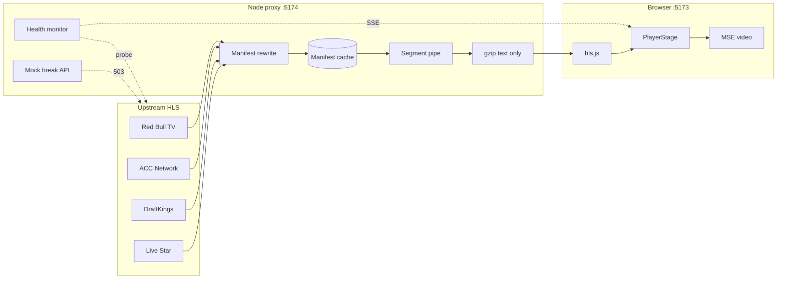

# Axis-live-streaming

> A live sports streaming platform that aggregates and re-delivers HLS feeds to viewers in a browser.

## Quick Start

```bash
# Node 20+ recommended
pnpm install & pnpm start
```

Open [http://localhost:5173](http://localhost:5173) 

## Architecture (TL;DR)

```
┌─────────────────────────────────────────────────────────────────────────┐
│  Upstream HLS (Akamai / Amagi / Zype / SiliconWeb)                       │
└───────────────────────────────┬─────────────────────────────────────────┘
                                │ HLS
                                ▼
┌─────────────────────────────────────────────────────────────────────────┐
│  Node proxy :5174                                                        │
│  Manifest rewrite (same-origin paths) → LRU cache → segment pipe → gzip  │
│  (text only)                                                            │
│  Health probe (5s) ── SSE ──► browser    Mock: POST /mock/break/:id      │
└───────────────────────────────┬─────────────────────────────────────────┘
                                │ m3u8 + ts (same-origin only)
                                ▼
┌─────────────────────────────────────────────────────────────────────────┐
│  Browser :5173                                                           │
│  hls.js → PlayerStage → MSE / video                                      │
└─────────────────────────────────────────────────────────────────────────┘

Rule: the browser only talks to our backend, never directly to upstream. The
proxy is the single source of truth — it hides upstream topology and
centralizes caching.
```



- **Frontend**: React 18 + Vite + hls.js 1.6 + Zustand.
- **Backend**: Node + TypeScript + native `http`.
- **Data flow**: the browser **only** talks to our backend. Never directly to upstream — the proxy is the single source of truth, hides upstream topology, and centralizes caching.

## Performance Optimizations

### P0 — Network layer

1. **Preconnect**: `<link rel="preconnect">` warms the backend; production injects upstream CDNs dynamically from `/channels.upstreamOrigins`.
2. **Channel prefetch**: `prefetchChannel` warms the master + first variant manifest on hover, cutting cold-switch latency.
3. **Channel-list cache**: `/channels` uses `max-age=60, stale-while-revalidate=600`.
4. **Segment cache**: segments are marked `immutable` and pass through `Last-Modified` + `If-Modified-Since` for 304s.
5. **Playback log**: `navigator.sendBeacon` reports metrics; doesn't compete with HLS segment sockets.

### P1 — Runtime

1. **ABR seed**: `abrEwmaDefaultEstimate` reads `navigator.connection.{downlink,effectiveType}`, avoiding 3-5s startup downshift on weak / mobile networks.
2. **Manifest LRU**: `upstreamManifestCache` capacity 100; long-running process won't leak on unique URLs.
3. **Service Worker**: caches the app shell + `/channels` (network-first + background refresh) for snappier repeat visits.

### P2 — Transport

1. **Gzip text only**: `/channels`, manifests, and API responses are gzipped (manifest ~1-3KB → ~400B).
2. **Don't gzip video**: `video/mp2t` is already compressed; gzipping it only burns CPU.

## Trade-offs

- **hls.js direct, no Video.js / Shaka wrapper** — gain fine-grained control over buffer / ABR / error recovery (our `RecoveryGate` 4-state machine + `fragLoadPolicy` 1.6 declarative loading policy both call hls.js directly); cost is handling every failure mode ourselves. A wrapper library saves time but hides the levers that matter.
- **Single-instance Node backend, all state in-process** — gain zero external dependencies and trivial deployment (manifest LRU cache + SSE broadcaster + segment proxy all share memory); cost is per-instance caches and SSE on horizontal scale (would need Redis pub/sub).
- **No WebRTC / MediaMTX** — gain the ability to focus the 48h budget on HLS stream quality; cost is the latency ceiling of ~2-6s (LL-HLS) or 6-30s (standard HLS), which rules out sub-second edge for marquee events.
- **Smoothness over latency** — `hlsConfig` Tune 3 (`liveSyncDuration=10s` + `maxBufferLength=80s`) trades 10s of live edge for an 8-10s stable buffer and a stall rate under 1%; cost is ~5-7s extra to start playing and 10s from the live edge.

## Next Steps

1. **Playwright metrics** — automated scripts that drive a full viewing session (cold start, channel switch, sustained playback) and emit reproducible numbers. Must measure: TTFF, stall count + duration, channel-switch latency (prefetched vs cold). Cover weak-network (e.g. throttled 4G) vs normal and use the mock injector to measure recovery time on upstream failure. Fill in the `_TBD_` cells in the performance-optimization tables.
2. **Channel thumbnails** — give each channel a near-live frame snapshot for the channel grid. Backend exposes `GET /thumb/:channel.jpg`; ffmpeg periodically grabs a frame from the channel's HLS stream and updates the JPEG. The frontend `ChannelGrid` shows the thumbnail in the card (replacing plain text); on grab failure, fall back to a static logo or a placeholder.
3. **Concurrent viewer fanout** — the PRD's "Delivery / scale" axis: under N concurrent viewers, segment fanout to upstream must not scale linearly. Move the segment cache to Redis (or front the whole thing with a CDN) and add manifest rewriting in front. Verify by load test that upstream hit count stays bounded.
4. **Multi-protocol playback (WebRTC et al.)** — currently HLS live only. Per-channel protocol configuration, with the player dispatching by protocol. WebRTC / WHEP for sub-second live (co-exists with the HLS path, switchable per channel). LL-HLS as a middle ground between HLS and WebRTC. MP4 progressive for highlights / previews / post-game replay (native `<video>`, no extra dependencies).

## License

MIT
