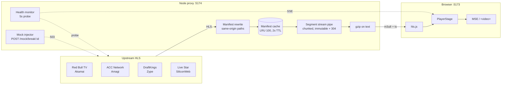

# axis-live-streaming

> 聚合并转发 HLS 直播流到浏览器观看的体育直播平台。

## 性能优化（核心方案）

**P0 网络层**：用 `<link rel=preconnect>` 预热后端和上游 CDN origin（dev 用 link，prod 通过 `/channels` 响应里的 `upstreamOrigins` 动态注入）；`prefetchChannel` 在 hover 频道时预热 master + 第一个 variant 的 manifest；`/channels` 加 `max-age=60, stale-while-revalidate=600`，segment 标 `immutable` 并透传 `Last-Modified` 支持 `If-Modified-Since` 304。播放日志用 `navigator.sendBeacon` 上报，不抢 HLS 段 socket。

**P1 运行时**：`abrEwmaDefaultEstimate` 从 `navigator.connection.{downlink,effectiveType}` 读初值，移动端 / 弱网开局不再 3-5s 卡顿降档；`upstreamManifestCache` 用 LRU 容量 100 防止长跑进程 unique URL 涨内存；Service Worker 缓存 app shell + `/channels`（网络优先 + 后台刷新），二次访问秒开。

**P2 传输层**：`/channels`、所有 manifest、API 响应加 gzip（manifest 1-3KB → ~400B，节 60-80%）；视频段响应 (`video/mp2t`) **不**加 gzip（已压缩，gzip 仅耗 CPU）。

**故意没做**：hls.js 段 `fetchPriority: high`（XHR loader 不支持透传）；HTTP/3 / QUIC（< 1% 用户受益）；主 manifest 缓存到 SW（HTTP cache + SWR 够用，加 SW 增 stale 风险）。

## 快速上手

```bash
# Node 20+ recommended
pnpm install
pnpm start              # boots backend (:5174) + frontend (:5173)
```

打开 http://localhost:5173，应该看到 4 频道网格 + 主播放器。

## 架构（TL;DR）



- **前端**：React 18 + Vite + hls.js 1.6 + Zustand）。
- **后端**：Node + TypeScript + native `http` + `ws`。
- **数据流**：浏览器**只**连自己的后端 WS/HTTP。绝不直连上游 —— proxy 是唯一真相源，藏住上游拓扑，集中处理缓存。


## 权衡取舍（核心）

- **hls.js 直接接，不包壳子**——换来对 buffer / ABR / 错误恢复的精细控制，代价是失败模式自己扛。壳子会藏住 `RecoveryGate` + `fragLoadPolicy` 调参，而这俩是关键。
- **单实例后端、进程内**——开发快，demo 不需要水平扩展。生产需要 Redis 缓存 + 多实例协调。
- **没有 WebRTC / MediaMTX**——48h 塞不下，列入下一步。当前架构「HLS 进、HLS 出」。
- **流畅优先，非延迟优先**——`hlsConfig` 的 Tune 3 用 ~2s 直播边距换稳定 8-10s 缓冲。PRD 权重对，作业这个倾斜方向正确。


## 下一步计划

1. **Playwright 指标量化**
   - 用自动化脚本跑完整观看流程（冷启动、切台、持续播放），输出可复现的指标报告。
   - 必测指标：**TTFF**（首帧时间）、**卡顿 / rebuffer 次数与时长**、**频道切换耗时**（预取 vs 冷切换）。
   - 覆盖 **弱网** 场景（如 4G 限速），与正常网络对比。
   - 用 mock 模拟上游故障，测量 **坏源恢复时间**（触发 failover 到新首帧）。
   - 将 README 性能优化表中仍为 `_TBD_` 的项填上实测数据。

2. **频道缩略图**
   - 每个频道提供一张**接近实时的画面缩略图**，供列表展示「正在直播」的观感。
   - 后端暴露 `GET /thumb/:channel.jpg`，按频道 ID 返回 JPEG。
   - 缩略图由 **ffmpeg** 从该频道 HLS 流周期性抓取并更新。
   - 前端 `ChannelGrid` 在频道卡片上展示缩略图（替代纯文字卡片）；抓取失败时有占位或降级展示。

3. **源故障恢复（Resilience）**
   - PRD 核心考察点：源 drop / stall 时能否**优雅恢复**，而非静默播错内容。
   - 无同源 backup 时：**不自动切到其它频道**；UI 明确展示 degraded / down 状态，引导用户手动切台或等待恢复。
   - Review 时可演示：mock 断源 → 状态变化 → 恢复播放（可测量恢复耗时）。
   - Failover 备用 URL 若启用，须**经 proxy 同源转发**，不 bypass 直连上游。

4. **并发扩展（多观众扇出）**
   - PRD「Delivery / scale」考察：多并发观众时，segment 回源不应线性放大。
   - 段缓存外置（如 Redis）+ CDN 前置；manifest 仍由 proxy 改写，segment 可走缓存路径。
   - 验证 N 路并发下回源次数与首帧/卡顿不劣化。

5. **多协议播放支持（WebRTC 等）**
   - 当前仅 **HLS 直播**；扩展为按频道配置多种协议，播放器按协议分流。
   - **WebRTC / WHEP**：核心赛事低延迟直播（亚秒级），与现有 HLS 路并存、可切换。
   - **LL-HLS**：在保留 HLS 生态的前提下降低直播边缘延迟，作为 HLS 与 WebRTC 之间的折中。
   - **MP4 Progressive**：集锦、预览、赛后回放等非直播内容，浏览器原生 `<video>` 播放。

## 协议

MIT
