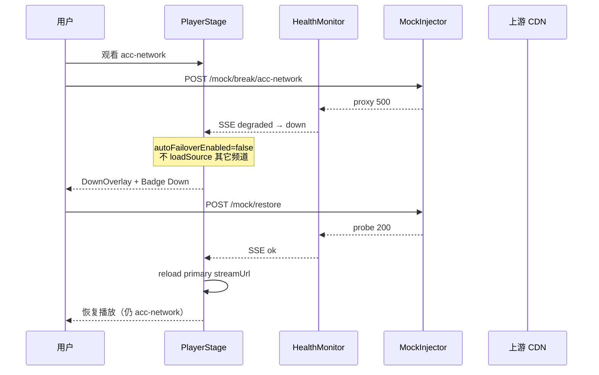

# 源故障恢复（Failover）技术方案与开发计划

> **对应项**：`docs/开发计划.md` **P0-3** · PRD「串流品質」中的 *graceful recovery*  
> **目标**：无同源 backup 时**禁止**自动切到其它频道；Review 可稳定演示 **断源 → 状态 → 恢复**。

---

## 1. 背景与问题

### 1.1 PRD 期望

考官在 Stream quality（40%）中会问：源 drop / stall 时能否**优雅恢复**，而不是静默播错内容。

### 1.2 当前实现（两处 failover，语义不一致）

| 路径 | 触发 | 行为 | 问题 |
|------|------|------|------|
| **SSE 驱动** | `health === 'down'` 持续 2s | `PlayerStage` 自动 `loadSource(backupStreamUrls[nextIdx])` | `backupUrls` 多为**其它频道**的 master URL → 用户点 A 看到 B（NHL→ACCDN 已因此从 registry 移除） |
| **hls.js 致命错误** | `RecoveryGate` → `failover` | 按 `nextBackupIndex()` 切 `backupStreamUrls[idx]` | 同上；且 backup URL **直连上游**，绕过 proxy |

```202:224:frontend/src/components/Live/PlayerStage.tsx
  // Improvement 3: subscribe to health monitor, auto-switch to backup after 2s of down
  useEffect(() => {
    if (health !== 'down' || !channelId) return;
    const t = setTimeout(() => {
      const currentIsBackup = (backupStreamUrls ?? []).some(b => hlsRef.current?.url === b);
      const nextIdx = currentIsBackup ? 1 : 0;
      const target = (backupStreamUrls ?? [])[nextIdx];
      if (!target || !hlsRef.current) return;
      // ... destroy + loadSource(target) — 可能是其它频道
    }, 2_000);
```

### 1.3 配置层现状

`channels.config.ts` 中 `backupUrls` 混用两类 URL：

1. **同源 / 同内容**：如 Red Bull 的 `master_6660.m3u8`（单码率 fallback，同一 Akamai 路）
2. **跨频道**：其它频道的 `primaryUrl`（last resort，会换内容）

`livestar` 已设 `backupUrls: []`，避免 SSE 误切——说明团队已认知问题，但未系统化。

---

## 2. 目标与非目标

### 2.1 目标（Must）

| # | 目标 | 验收 |
|---|------|------|
| G1 | 区分 backup 类型，**仅同源 backup 允许自动 failover** | mock 断源后，无同源 backup 的频道**不**自动 `loadSource` 其它频道 |
| G2 | 无可用同源 backup 时，UI 明确 **degraded / down**，引导手动切台或等待恢复 | 覆盖播放器遮罩 + `SourceStatusBadge` + 可选 toast |
| G3 | Review 可重复演示：**断源 → 状态变化 → restore → 同频道恢复播放** | `POST /mock/break/:id` → `POST /mock/restore`，全程频道 ID 不变 |
| G4 | 自动 failover 的 URL **一律经 proxy 同源路径** | 浏览器 Network 里不出现对 `akamaized.net` 等上游的直接 segment 请求（failover 场景） |

### 2.2 非目标（Won't，本迭代不做）

- 为每个频道寻找「同内容、不同 CDN」的完整 backup 矩阵（时间不够；仅整理现有可同源项）
- WebRTC / LL-HLS  failover
- 跨频道 backup 作为「最后手段」自动切换（Review 演示价值低且易翻车）
- 修改 `healthMonitor` 探针策略（沿用 5s probe + degraded/down 状态机）

---

## 3. 技术方案

### 3.1 Backup 分类与数据模型

在 `Channel` 上**显式拆分** backup，废弃「扁平 `backupUrls` 混用」：

```ts
/** 与当前频道同一内容、不同 manifest/码率/CDN 路 */
export interface SameContentBackup {
  readonly url: string;           // 上游绝对 URL（注册表内）
  readonly label?: string;        // 可选，HUD 用，如 "1080p single-bitrate"
}

export interface Channel {
  // ...现有字段
  readonly sameContentBackups: readonly SameContentBackup[];
  /** @deprecated 迁移期可读；禁止写入跨频道 URL */
  readonly backupUrls?: readonly string[];
}
```

**规则：**

| 类型 | 自动 failover | 经 proxy | 示例 |
|------|---------------|----------|------|
| `sameContentBackups` | ✅ 允许（SSE + RecoveryGate） | ✅ 必须 | Red Bull `master_6660.m3u8` |
| 跨频道 URL | ❌ 禁止自动切换 | — | 从各频道 `backupUrls` 中**删除** |

**迁移策略（channels.config.ts）：**

| 频道 | sameContentBackups | 删除的跨频道项 |
|------|-------------------|----------------|
| `red-bull-tv` | `[master_6660.m3u8]` | ACCDN、DraftKings URL |
| `acc-network` | `[]`（暂无同源） | Red Bull、DraftKings |
| `draftkings` | `[]` | Red Bull、ACCDN |
| `livestar` | `[]` | 已是空 |

> 无同源 backup 的频道：**只允许** destroy/rebuild 同一 `streamUrl`、用户手动切台、或上游恢复后 reload，**不允许**自动换 master 到其它 `channelId` 的内容。

### 3.2 API：`/channels` 响应

后端在 `server.ts` 组装频道列表时输出：

```json
{
  "id": "red-bull-tv",
  "streamUrl": "/hls/red-bull-tv/master.m3u8",
  "sameContentBackupUrls": ["/hls/red-bull-tv/master_6660.m3u8"],
  "autoFailoverEnabled": true
}
```

- `sameContentBackupUrls`：已由 proxy 改写的**相对路径**（与 `streamUrl` 一致规则）
- `autoFailoverEnabled`：`sameContentBackupUrls.length > 0`
- **不再**向客户端下发跨频道 `backupStreamUrls`（或字段保留但恒为空数组，兼容一期前端）

### 3.3 前端行为变更

#### 3.3.1 移除 SSE 跨频道自动切台

删除或替换 `PlayerStage` 中 `health === 'down'` → `loadSource(backup)` 的 2s 定时器逻辑：

```
health === 'down' && !autoFailoverEnabled
  → 显示 DownOverlay（暂停/保持最后一帧 optional）
  → 停止 hls 拉流或仅保留 UI（推荐：stopLoad + 展示状态，避免无意义 500 重试）

health === 'down' && autoFailoverEnabled && sameContentBackupUrls.length > 0
  → 等待 2s（与现有一致）→ 仅 loadSource(sameContentBackupUrls[0])
  → failoverNotice: "已切换同源备用流"
```

#### 3.3.2 RecoveryGate `failover` 分支

`case 'failover'` 时：

1. `idx = gate.nextBackupIndex()` 映射到 **`sameContentBackupUrls[idx]`** 而非跨频道列表
2. 若 `idx` 超出数组 → **不** fallback 到其它频道；进入 `All backups exhausted` UI（与 G2 一致）
3. `destroyRebuild` 仍使用当前频道 `streamUrl`（不变）

#### 3.3.3 UI 组件

| 组件 | 职责 |
|------|------|
| `SourceStatusBadge` | 已有 ok / degraded / down；补充 `reason` 文案（来自 SSE `reason` 字段） |
| **`PlaybackBlockedOverlay`**（新建） | `down` 且无自动 failover 时：遮罩 +「信号中断」+「请切换其它频道或等待恢复」 |
| **`RecoveryActions`**（可选内嵌） | `down` 时显示 **重试当前源** 按钮 → `hls.loadSource(streamUrl)` + `gate.reset()` |
| `failoverNotice` | 仅在同源切换成功时显示；禁止出现其它频道名称 |

**Store 扩展（可选）：**

```ts
playbackState: 'playing' | 'waiting_recovery' | 'same_content_failover';
```

本迭代可用局部 `useState` 降低改动面。

#### 3.3.4 上游恢复

当 `health` 从 `down` → `ok`（mock restore 或真实恢复）：

```ts
useEffect(() => {
  if (health !== 'ok' || !channelId) return;
  if (wasInDownOrFailover) {
    gateRef.current.reset();
    reloadPrimary(streamUrl);  // 回到主 manifest
    setFailoverNotice(null);
    clearDownOverlay();
  }
}, [health, streamUrl, channelId]);
```

需用 `useRef` 记录上一 health，避免每次 `ok` 都误 reload。

### 3.4 Proxy 一致性

自动 failover 禁止 `loadSource('https://rbmn-live.akamaized.net/...')`。

实现方式（二选一，推荐 A）：

| 方案 | 做法 |
|------|------|
| **A（推荐）** | 后端只下发 `/hls/:id/...` 形式；前端从不持有上游绝对 URL |
| B | 前端保留绝对 URL，统一过 `toProxyUrl(channelId, path)`  helper |

与 README 已知问题「backup bypass proxy」一并关闭。

### 3.5 Mock 演示契约（已有，补齐文档）

| 接口 | 作用 |
|------|------|
| `POST /mock/break/:channelId` | 该频道 HLS 请求 30s 内返回 500 → health → degraded → down |
| `POST /mock/restore` | 清除 mock → probe 恢复 → health → ok |
| `GET /mock/status` | 演示前确认 |

**推荐演示频道：**

- **`acc-network`** 或 **`draftkings`**：无同源 backup → 验证 **不自动切台** + DownOverlay
- **`red-bull-tv`**：有 `master_6660` → 可选第二段演示 **同源 failover**（与跨频道对比）

### 3.6 架构示意



---

## 4. 开发计划

### 4.1 工期与里程碑

| 阶段 | 内容 | 工期 |
|------|------|------|
| **M1** | 数据模型 + `/channels` API + 配置迁移 | 2–3h |
| **M2** | 前端：移除跨频道 SSE failover + RecoveryGate 限制 + proxy URL | 3–4h |
| **M3** | UI：DownOverlay、恢复 reload、Badge reason | 2–3h |
| **M4** | 测试 + Review 脚本 + README 更新 | 2h |
| **合计** | | **0.5–1 天** |

### 4.2 任务清单

#### M1 — 后端与配置

- [ ] `backend/src/streaming/channels.config.ts`：新增 `sameContentBackups`，删除跨频道 `backupUrls`
- [ ] `backend/src/streaming/registry.ts`：校验 `sameContentBackups` 路径可解析；`backupUrls` 迁移期可选废弃
- [ ] `backend/src/server.ts`：`/channels` 返回 `sameContentBackupUrls`（proxy 路径）、`autoFailoverEnabled`
- [ ] `frontend/src/lib/channels.config.ts`：类型与 `/channels` 消费对齐
- [ ] `backend/src/__tests__/registry.test.ts`：更新 fixture

#### M2 — 播放与恢复逻辑

- [ ] `PlayerStage.tsx`：重写 SSE `down` 分支（G1、G3）
- [ ] `PlayerStage.tsx`：`failover` 仅用 `sameContentBackupUrls`；耗尽时 UI 而非跨频道（G1）
- [ ] `PlayerStage.tsx`：`health` ok 时回切 primary（G3）
- [ ] `recoveryGate.test.ts`：断言无 backup 时 failover 不引入跨频道 URL（mock 列表长度 0）
- [ ] 删除或清空各频道配置中的跨频道 backup 引用

#### M3 — UI

- [ ] 新建 `PlaybackBlockedOverlay.tsx`（或合入 `PlayerStage`）
- [ ] `SourceStatusBadge`：展示 SSE `reason`（store 增加 `reasonByChannel` 或在 `useSourceHealthSse` 写入）
- [ ] 「重试当前源」按钮（G2）
- [ ] `failoverNotice` 文案改为「已切换同源备用码率」类表述

#### M4 — 验证与文档

- [ ] 手动脚本写入 `docs/review-demo-script.md`（failover 章节，可与全局 review 文档合并）
- [ ] `README.md` / `README.zh-CN.md`：更新 Known issue 为 **Fixed in P0-3**；说明演示命令
- [ ] `pnpm --filter backend test` + `pnpm --filter frontend test`
- [ ] 本地跑通：break acc-network → 不切换 → restore → 同频道播放

### 4.3 验收标准（Definition of Done）

| ID | 场景 | 预期 |
|----|------|------|
| AC1 | `POST /mock/break/acc-network`，用户正在看 ACCDN | 2s 后**仍**为 ACCDN 频道选中状态；**不**出现 Red Bull / DraftKings 画面 |
| AC2 | AC1 期间 UI | `SourceStatusBadge` = Down；遮罩可见；可选重试按钮 |
| AC3 | `POST /mock/restore` | 10s 内 health → ok，自动或一键恢复主源播放 |
| AC4 | `POST /mock/break/red-bull-tv`（有同源 backup） | 可自动切至 `master_6660`；Notice 标明同源备用；**不**出现其它频道名 |
| AC5 | Network 面板 | failover 时 segment/manifest 请求 host 仅为 `localhost` 或部署域名 |
| AC6 | 生产构建 | `POST /mock/*` 返回 404（已有逻辑不变） |

### 4.4 Review 演示脚本（5 分钟片段）

```bash
# 终端 1：启动
pnpm start

# 终端 2：断源（无同源 backup）
curl -X POST http://localhost:5174/mock/break/acc-network
# 浏览器：选 ACC Digital Network，观察 Down 状态，确认画面未变成其它体育台

# 恢复
curl -X POST http://localhost:5174/mock/restore
# 口述：health SSE → ok → 自动 reload 主源

# 可选对比：有同源 backup
curl -X POST http://localhost:5174/mock/break/red-bull-tv
# 说明：仅切换同频道单码率备用，非聚合站「换台」
curl -X POST http://localhost:5174/mock/restore
```

**口述要点（Problem-solving 25%）：**

- 跨频道 URL 作 backup 在聚合场景会**播错内容**，比黑屏更差 → 禁止自动切换
- 有同源单码率时保留 failover，牺牲 ABR 换连通性
- 无 backup 时依赖 probe + 用户手动切台，符合 48h 务实取舍

### 4.5 风险与回滚

| 风险 | 缓解 |
|------|------|
| 删除跨频道 backup 后，真实上游挂掉仅同源频道能自动降级 | Review 用 mock 演示；README 写明「生产需同内容多 CDN 才启用 auto failover」 |
| `health` 抖动导致频繁 reload | `ok` 恢复加 500ms debounce；仅 `prevHealth === 'down'` 时触发 reload |
| ACCDN / DraftKings 断源后长时间黑屏 | 接受；遮罩 + 手动切台优于播错；可点重试 |

回滚：恢复 `PlayerStage` SSE 块与旧 `backupUrls` 配置（单文件 revert）。

### 4.6 与全局开发计划的衔接

| 文档 | 关系 |
|------|------|
| `docs/开发计划.md` § P0-3 | 本文件为其**实施级**展开 |
| `docs/streaming-technical-design.md` §4.6 / §5.3 | 实现后回写 failover 决策表与序列图 |
| `docs/prd-zh.md` 开发要求「品质优先」 | AC1–AC6 直接对应 |

---

## 5. 实现后 README 片段（待粘贴）

```markdown
### 源故障恢复（P0-3）

- **自动 failover** 仅在同内容备用 manifest 存在时触发（如 Red Bull 单码率 `master_6660`）。
- **无同源 backup** 时：显示 Down/Degraded，**不会**自动播放其它频道；请手动切台或等待上游恢复。
- **演示**：`curl -X POST http://localhost:5174/mock/break/acc-network` → 观察状态 → `curl -X POST http://localhost:5174/mock/restore`。
- 详见 `docs/failover-recovery-技术方案与开发计划.md`。
```

---

*文档版本：2026-06-04 · 状态：待实施*
