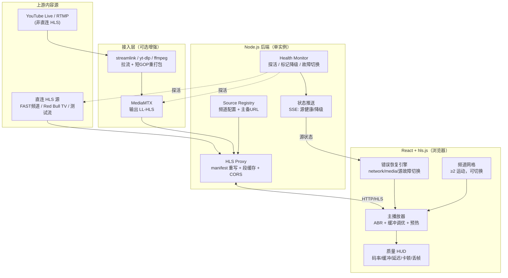
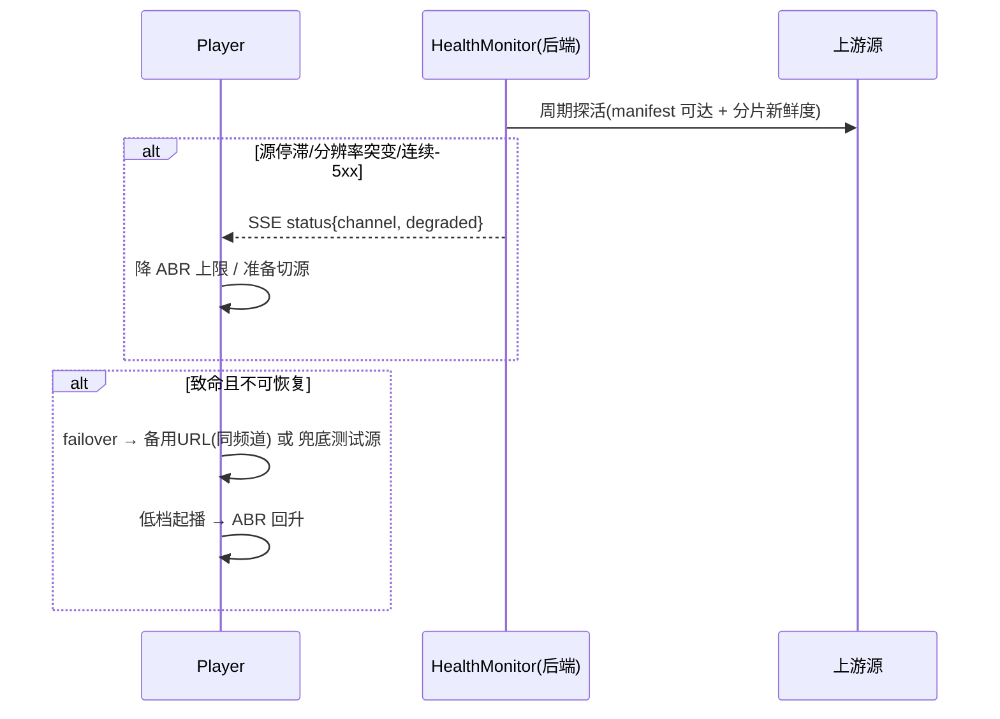
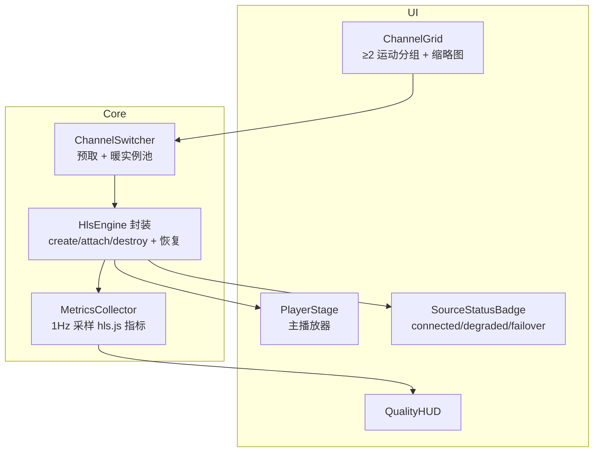

# 技术方案 — 直播体育流媒体聚合平台

> 直播体育流媒体聚合平台的需求分析与可行技术方案。
> 目标：在浏览器中聚合并重新分发多路体育直播，**流质量优先**（启动速度、延迟、卡顿、ABR、容错）。

---

## 1. 关键技术选型与理由

### 1.1 协议选择：HLS 为基线，自接入源上 LL-HLS

| 协议 | 延迟 | 浏览器支持 | 适配本场景 | 决策 |
|------|------|-----------|-----------|------|
| **HLS（hls.js + MSE）** | 6–30s（标准）/ 2–6s（调优） | 全桌面浏览器 | 批准源大多原生 HLS；生态最成熟 | ✅ **基线，全平台** |
| **LL-HLS** | 0.5–3s | 同上（config 开关） | 仅对「自己接入/打包」的源可控 | ✅ **自接入源启用** |
| DASH（dash.js） | 与 HLS 相当 | 好 | 与 HLS 重叠，无额外收益 | ❌ 跳过，README 说明 |
| WebRTC | <500ms | 好但复杂 | 不契合「聚合既有 HLS 源」，ROI 低 | ⚠️ 仅作为「next steps」 |

**理由**：批准内容源绝大多数已是 HLS；`hls.js` 在 ABR、错误恢复、缓冲管理上久经考验。WebRTC 延迟最低，但需要对每路源做 SFU/重新打包，与「聚合再分发既有直播」的目标不匹配——作为「更多时间会做」的方向写进 README。

### 1.2 播放器：hls.js（不套壳）

直接用 `hls.js` 而非 Video.js/Shaka 封装层——更细的缓冲/ABR/错误控制权，正是流质量评分的核心所在。Safari 走原生 HLS（`canPlayType('application/vnd.apple.mpegurl')`）兜底。

### 1.3 后端：Node.js + TypeScript

| 候选 | 取舍 |
|------|------|
| **Node.js（选用）** | 迭代最快，HLS 代理/缓存/SSE 健康推送都很轻量 |
| Go | goroutine 扇出更优、转码编排更稳；但本场景重 I/O 代理、轻 CPU，Node 足够且更快出活 |

> CPU 密集的转码不在 Node 进程里做，而是交给 **ffmpeg / MediaMTX** 子进程，Node 只做编排与代理。

### 1.4 接入/转码：ffmpeg + MediaMTX（仅非 HLS 源需要）

- **MediaMTX**：零依赖单二进制媒体服务器，可接收 RTMP/RTSP/SRT 并自动输出 **LL-HLS**（`hlsVariant: lowLatency`，`hlsPartDuration: 200ms`，实测延迟 0.5–3s）。
- **ffmpeg / streamlink / yt-dlp**：把 YouTube Live、RTMP 等非直连 HLS 源拉流，必要时重打包/转码后推给 MediaMTX。短 GOP（`-g 30`）以缩短分片、降低延迟。

> 这是**可选增强层**。MVP 阶段只播直连 HLS 源即可满足「两种运动」要求；接入层用于把「真实体育 YouTube 直播」纳入，提升说服力。

### 1.5 关键参数与阈值（配置表）

所有 magic number 必须集中在此处，实施时直接引用，避免散落在代码里成为评审质疑点：

| 参数 | 当前值 | 依据 / 触发条件 | 调参信号 |
|------|--------|------------------|----------|
| `liveSyncDuration` | 3s | 直播边缘容忍 3s 抖动，<2s 易卡顿 | 切源时观察 |
| `maxBufferLength` | 30s | 内存预算 ~150MB/路 | 长 session 监控 |
| `backBufferLength` | 30s | 控回看缓冲 | OOM 时下调 |
| `manifest 缓存 TTL` | 0（不缓存） | 滑动窗口 media-sequence 必须重拉 | 死锁则改 200ms |
| 段缓存 `N` | 10 段 | 直播 6s/段 × 10 ≈ 1min 窗口，3 观众起步 | OOM 降到 5 |
| 探活 `5xx 阈值` | 3 次/30s | 区分抖动 vs 真挂 | 切源频率反向调 |
| 探活 `segment 新鲜度` | 2×标段长 | 直播 6s 段，>12s 无新段视为停滞 | 误判多就 3× |
| 恢复 `recoverMediaError` 限频 | 2 次/10s | 2 次失败就重建实例 | 卡循环就降到 1 次 |
| 源降级 `degraded` 阈值 | 1 次 stall > 5s | 短抖不降级 | 演示时调严 |
| 源切备 `failover` 触发 | down ≥ 5s | 给后端探活 5s 窗口 | 太敏感就 10s |
| 暖池 `K` | 0（先不做） | 复杂度高，MVP 跳过 | 演示允许冷切换 < 2s 则维持 |
| ABR EWMA fast/slow | 3.0 / 9.0 | hls.js 默认附近 | 抖动多就 5/15 |
| 暖池实例存活 TTL | 30s | 超时回收 | 切换频繁则拉长 |

> **纪律**：所有阈值写入 `backend/src/streaming/config.ts` 与 `frontend/src/live/config.ts`，代码中不允许出现裸数字。

---

## 2. 系统架构

### 2.1 总览



### 2.2 端到端数据路径

```
浏览器请求 /hls/:channel/master.m3u8
  → 后端 Proxy 取上游 manifest（或 MediaMTX 输出）
  → 重写分片/子清单 URL 指向自身 /hls/:channel/segment
  → 段缓存命中则直接返回（多观众不重复回源）
  → hls.js 解析 master → 选层 → 拉分片 → MSE appendBuffer
  → ABR 根据 EWMA 带宽估计升/降档
  → 出错：非致命忽略；致命按类型恢复；源持续坏 → 切备用源
  → HUD 每秒读取 hls.js 指标渲染（不触发列表级重渲染）
```

### 2.3 后端代理为什么必要（不止是 CORS）

| 收益 | 说明 |
|------|------|
| **CORS** | 浏览器直连第三方源常被 CORS 拦截；统一同源代理解决 |
| **扇出/缓存** | 多观众共享同一段缓存，回源压力与「按观众重复工作」解耦 |
| **隐藏源** | 上游 URL 不暴露给前端，便于热切换/故障转移 |
| **统一鉴权/限速口** | 留出后续扩展位 |
| **健康监控** | 后端探活、判定降级、把状态经 SSE 推给前端做主动切换 |

### 2.4 多频道并排（stretch）单帧带宽预算

> 进阶功能：WorldMonitor 式 2×2 网格同时播放多路源。**默认不实现**，但在架构层面**预算要算清**，避免后续接 4 路时 24Mbps 直接吃光家用宽带。

| 路数 | 单路目标码率 | 总带宽 | 适用场景 |
|------|--------------|--------|----------|
| 1（主播放器） | 6 Mbps | 6 Mbps | 默认模式 |
| 2 | 3 Mbps | 6 Mbps | 双路对比 |
| 4（2×2 网格） | 1.5 Mbps | 6 Mbps | WorldMonitor 式 |

**约束**：

- 网格模式 `capLevelToPlayerSize: true` 强制生效（避免 1080p×4 浪费）
- 网格模式 `maxMaxBufferLength` 减半（4 路 × 30s = 大量内存）
- 4 路总带宽预算硬上限 8 Mbps；超出时降级为「主 1 + 缩略 3」模式
- 主格保留音频，其余 3 路 `video.muted = true`

**接口预留**（不实现，文档占位）：`MultiChannelGrid` 组件，支持 `layout: '2x2'`、`maxTotalBandwidthMbps: 8`、`audioChannel: 'primary'`（仅主格出声）。

---

## 3. 流质量工程

### 3.1 hls.js 关键配置（直播调优）

| 配置项 | 值 | 目的 |
|--------|-----|------|
| `lowLatencyMode` | true | LL-HLS（自接入源生效），贴近直播边缘 |
| `liveSyncDuration` | 3s | 距直播边缘 ~3s 容忍抖动 |
| `maxLiveSyncPlaybackRate` | 1.1 | 落后时 1.1x 追边缘，避免越拖越远 |
| `enableWorker` | true | 解封装放 worker，主线程不卡 |
| `backBufferLength` | 30s | 限制回看缓冲，控内存 |
| `capLevelToPlayerSize` | true | 按播放器尺寸封顶分辨率，省带宽 |
| `abrEwmaFastLive` / `abrEwmaSlowLive` | 3.0 / 9.0 | 直播带宽估计快/慢窗，平衡升档激进度与抖动 |

### 3.2 快速频道切换

| 手段 | 实现 |
|------|------|
| **manifest 预取** | 鼠标 hover / 焦点频道时，后端预热其 master.m3u8 与首段，点击即播 |
| **暖实例池** | 为相邻/热门频道保留 1–2 个已 attach 的 hls.js 实例，切换时 swap，而非冷启动 |
| **低起播档** | 切换瞬间从低码率起播，2–3s 内 ABR 升上去，避免「转圈」 |
| **保留旧帧** | 切换时不立即清空 video，新流首帧 ready 再切，减少黑屏闪烁 |

### 3.3 错误恢复引擎（坏源自愈）

基于 hls.js 官方推荐模式，**只处理 `data.fatal === true`**（非致命交给库自动重试）：

| 错误类型 | 恢复动作 |
|----------|----------|
| `NETWORK_ERROR` | `hls.startLoad()`，重启分片拉取状态机 |
| `MEDIA_ERROR`（首次） | `hls.recoverMediaError()`，重建 MSE source buffer |
| `MEDIA_ERROR`（二次） | `hls.swapAudioCodec()` + `hls.recoverMediaError()` |
| 其他致命错误 | `failoverToBackupSource()`，切备用源或重建实例 |

**关键纪律**（来自 hls.js issue 实践）：

1. 非致命错误（含 `BUFFER_STALLED_ERROR` 卡顿）**不要**调用 `recoverMediaError`，否则会把播放打断得更频繁、陷入恢复死循环。
2. 恢复要**限频**：短时间内 `recoverMediaError` 失败 ≥2 次 → `destroy()` 并用新源重建实例。
3. `destroy()` 只在所有恢复都失败时作为最后手段。

> **限频与封顶的完整实现见 §3.5**。本节给出的是最小骨架。

### 3.4 源降级 / 故障转移



- 每个频道配置 `primaryUrl` + `backupUrls[]`；坏源切备用，备用都坏切「永不黑屏」的兜底测试流，并在 UI 上明确标注「已切换备用源」。
- 中途分辨率变化由 hls.js + MSE 自动处理；后端额外监控分片时长/序号是否异常。

### 3.5 质量可视化 HUD

实时展示：当前层级/分辨率、估计带宽、当前缓冲秒数、距直播边缘延迟、累计卡顿次数与时长、丢帧数（`video.getVideoPlaybackQuality()`）、源健康状态。

> HUD 既是 ABR/缓冲调优的依据，又是评审演示时直观证明「流质量」的最佳道具。**HUD 仅作为佐证，量化指标见 §3.6。**

### 3.6 错误恢复的退避与封顶

§3.3 的恢复序列在**没有时间窗口**的情况下会陷入「每 100ms recover 一次」的死循环。实施时必须加限频与封顶：

**RecoveryGate 状态机**（10s 滑动窗口）：

- `maxRecoverMedia = 2`：10s 内最多 2 次 `recoverMediaError`
- `maxDestroyRebuild = 3`：10s 内最多 3 次实例重建
- `maxFailover = 4`：10s 内最多 4 次切源
- 计数 + 时间戳，10s 静默期后归零

恢复决策表：

| 当前错误 | 在 10s 窗口内的累计次数 | 动作 |
|----------|--------------------------|------|
| `NETWORK_ERROR` | 1 | `hls.startLoad()` |
| `NETWORK_ERROR` | 2 | `hls.startLoad()` + 强制锁档 `currentLevel` |
| `NETWORK_ERROR` | ≥3 | 走 `OTHER` 路径：destroy + 备用源 |
| `MEDIA_ERROR` | 1 | `hls.recoverMediaError()` |
| `MEDIA_ERROR` | 2 | `hls.swapAudioCodec()` + `hls.recoverMediaError()` |
| `MEDIA_ERROR` | ≥3 | 走 `OTHER` 路径：destroy + 备用源 |
| `OTHER` (mux/manifest 等) | 1 | `hls.destroy()` + 同一 URL 新建实例 |
| `OTHER` | 2 | 切 `backupUrls[0]`，从低档起播 |
| `OTHER` | 3 | 切 `backupUrls[1]`，从低档起播 |
| `OTHER` | ≥4 | 切兜底测试流（NASA / Mux），UI 显示「演示模式」 |

**关键纪律**：

1. **非致命错误**（含 `BUFFER_STALLED_ERROR` 卡顿）**不要**调 `recoverMediaError`——会让卡顿更频繁。
2. **限频归零**靠 10s 静默期：最后一次 fatal 之后 10s 无新 fatal → 计数清零。
3. **destroy 是最后手段**：用同一 URL 重建失败 1 次再 destroy。
4. 失败计数器**跨错误类型共享**（一个窗口内 NETWORK + MEDIA 累计触发降级），而不是各自独立。

### 3.7 可量化的验收标准

把「流质量」从主观感受变成可复现的数字。README 必须列出本表中的**实测值**。

| 指标 | 目标值 | 测试方法 |
|------|--------|----------|
| 首帧时间（TTFF） | < 1.5s（直连 HLS） / < 2.5s（LL-HLS） | Playwright + `performance.getEntriesByType('resource')` |
| 启动到首播放 | < 2s | 同上 |
| 频道切换耗时（已预取） | < 800ms | 自定义 metrics：点击 → `playing` 事件 |
| 频道切换耗时（冷切换） | < 2.5s | 同上 |
| 卡顿率 | < 1%（稳定网络下，5min 测试） | `hls.stallCount` / `totalPlayDuration` |
| 坏源恢复时间 | < 5s | 模拟 upstream 5xx，测 failover 触发到新源首帧 |
| 直播边缘延迟 | 2–5s（LL-HLS） / 6–30s（标准 HLS） | `hls.latency` 字段 |
| 内存占用（hls.js worker） | < 80MB/路 | Chrome DevTools snapshot |
| 帧丢失率 | < 0.5% | `video.getVideoPlaybackQuality()` |
| 0–95% 启动分位 | < 3s（含冷源首次拉取） | 5 次冷启动取 95 分位 |

### 3.8 故障模式与降级矩阵

| 故障 | 触发条件 | 检测方 | 恢复动作 |
|------|----------|--------|----------|
| 上游 5xx | HTTP 5xx 连续 3 次/30s | proxy 监测 | 切 `backupUrls[0]`，UI 标注「已切换备用源」 |
| 上游停滞 | segment 2×标段长未刷新 | proxy 监测 | 同上 |
| 切源后也挂 | 备用源连续 2 次降级 | proxy 监测 | 切兜底测试流，UI 标注「演示模式」 |
| proxy 进程挂 | Node 进程退出 | 平台自动重启 | 客户端 SSE 断线 → 弹 toast「服务暂不可用，请稍后」 |
| hls.js 加载失败 | CDN 不可达 / 被广告拦截 | player 启动 try/catch | 回退到 Safari 原生；桌面 Chromium 显示降级 UI |
| 浏览器内存爆 | 长时间播放 RSS > 200MB | metrics 1Hz 监控 | 切源 + 旧实例 destroy + 强制 `gc()`（开发模式） |
| 跨源 ABR 抖动 | EWMA 不收敛，10s 内切档 > 5 次 | metrics 监控 | 锁档 `currentLevel = -1` 取消 ABR |
| SSE 断线 | 网络抖动 | 客户端 EventSource auto-reconnect | 重连后请求 `/health/streaming` 补状态 |
| 跨域 header 突变更 | 上游去 CORS | proxy 兜底 | 走代理，不暴露浏览器直连 |
| 暖池失效 | 预热的 hls 实例被换源 | 切源时检测 | 销毁 + 冷启动新实例 |
| 并发观众挤爆 proxy | 段缓存命中 < 50% | 监控命中比 | 短期靠降级到低码率；长期上 CDN |

---

### 3.9 信源优劣判断（smoothness score v2）

> **问题**：§1.1 协议选型是工程层面"用什么"，§3.5 HUD 是运行层面"看着怎么样"。**还有一个问题没回答**：当多源并存时，**哪个源最值得优先播**？
>
> 仅看变体数 / 是否 LIVE / 上游可达 这三个**静态属性**会撒谎——DW English（Akamai LIVE，5 档）按静态分排第 1，实测 1 分钟 44 丢帧 + 2 卡顿。**真正的「流畅」得在真用户网络里测**。

#### 3.9.1 两层评分架构

| 层 | 何时用 | 计算位置 | 依据 |
|---|---|---|---|
| **staticScore**（静态）| 没实测数据 | 后端启动时算一次 | 变体数 + health |
| **observedScore**（实测）| 有 ≥5 sample | 后端按需读 jsonl | stalls + dropped + minBuffer |
| **finalScore** | 排序 | 取 observed（数据足够时），否则 static | 不混——避免乐观偏差 |

**核心原则**：**实测是 ground truth**，静态分是 fallback。两者不取平均、不取最大值（实测为 1、静态为 3 时不能写「3」）。

#### 3.9.2 staticScore 算法（v1）

```
base        = min(3, ⌊variants / 2⌋)        // 0-3
liveBonus   = live ? 1 : 0                    // ← v2 删了，详见 §3.9.5
healthPenalty = down ? 2 : degraded ? 1 : 0
staticScore = clamp(0, 5, base + liveBonus + healthPenalty)
```

> **v1 → v2 关键修正**：去掉 `liveBonus` —— 实测发现 LIVE Akamai (DW English) 反而比 VOD loop (Mux LL-HLS) 不稳。该 bonus 预测方向**相反**，不保留。

#### 3.9.3 observedScore 算法

```ts
function scoreObserved(stalls, dropped, minBuffer): number {
  // 0-2：卡顿几乎 0 → 2，1 次 → 1.5，2-3 次 → 1，>=4 → 0
  const stallPart = stalls === 0 ? 2 : stalls === 1 ? 1.5 : stalls <= 2 ? 1 : 0;
  // 0-2：丢帧 0 → 2，<5 → 1.5，<20 → 1，>=20 → 0
  const dropPart  = dropped === 0 ? 2 : dropped < 5 ? 1.5 : dropped < 20 ? 1 : 0;
  // 0-1：buffer 最低 ≥8s → 1，>=5s → 0.5，<5s → 0
  const bufPart   = minBuffer >= 8 ? 1 : minBuffer >= 5 ? 0.5 : 0;
  return clamp(0, 5, stallPart + dropPart + bufPart);
}
```

**维度设计**（按 4-2-1 权重）：
- **stalls**（4 / 8 = 50% 权重）：卡顿最影响体验
- **dropped**（2 / 8 = 25%）：丢帧是「卡但不报警」的隐性劣化
- **minBuffer**（1 / 8 = 12.5%）：边界安全余量
- 留 12.5% 留白给**未来维度**（如 FPS 抖动、bitrate 切换次数）

#### 3.9.4 数据收集 + 落盘

```
[client PlayerStage]
   mount event     ──┐
   5s sample  ──────┼─→ POST /api/log-playback  ──→  [backend playbackLog.ts]
   unmount event  ──┘                                            ↓
                                                                 appendFileSync
                                                                      ↓
                                                          /tmp/playback-YYYYMMDD.jsonl
                                                                      ↓
                                       GET /api/playback-summary ──→  parse + scoreObserved
```

**字段**（client 5s 上报一次）：
```ts
{
  channelId: string,
  event: 'mount' | 'sample' | 'unmount',
  stalls: number,           // 累计卡顿次数
  totalStallMs: number,     // 累计卡顿时长
  droppedFrames: number,    // 累计丢帧
  avgBufferSec: number,     // 当前 buffer
  avgBitrateKbps: number,   // 当前码率
  avgFps: number,           // 当前 fps
  ts: number                // 客户端时间戳
}
```

**Why log-on-disk, not in-memory**：
- 单实例重启数据不丢
- 跨日 / 跨 session 可对比
- 失败不阻塞主流程（best-effort `catch`）
- `tail + grep` 即可排查，无需另起 DB

#### 3.9.5 empirical 校准（v1 → v2 经验）

2026-06-03 在 localhost 跑 1 min × 2 频道对照实验，**v1 排序完全错**：

| 频道 | v1 静态 | v2 实测 (n=sample) | v2 最终 | 实际感受 |
|------|--------|-------------------|---------|----------|
| DW English | **3** | 1 (n=18) | **1** | 44 丢帧，buffer 跌到 0 |
| Mux LL-HLS | 2 | **4.5** (n=13) | **4.5** | 0 丢帧，buffer ≥ 121s |

**结论**：
1. `liveBonus` 不可靠（DW LIVE 反而最差）→ **删**
2. 静态分是**保守下限**，实测能给出更准的 0-5
3. 4-2-1 权重 + 5 sample 阈值**实测可用**（Mux 4.5 ≈ 现实）

#### 3.9.6 排序规则

```ts
haveEnoughData = observed && observed.samples >= 5;
finalScore = haveEnoughData ? observed.observedScore : staticScore;
channels.sort((a, b) => b.finalScore - a.finalScore);
```

**5 sample 阈值**：低于此视为「测得太少」，退回 static。防止 1 个极端 sample 误导。

#### 3.9.7 文件 / 端点索引

| 文件 | 作用 |
|---|---|
| `backend/src/streaming/playbackLog.ts` | 落盘 + `getPlaybackSummary()` 聚合 |
| `backend/src/server.ts` | `POST /api/log-playback`、`GET /api/playback-summary`、`GET /channels` |
| `frontend/src/components/Live/PlayerStage.tsx` | mount + 5s + unmount 上报 |
| `scripts/playback-test.sh` | 测试 driver（2 min × N 频道手动步骤）|
| `scripts/analyze-playback.py` | 离线分析（不依赖 dev server）|
| `docs/final-hls.md` | 实现记录（含 v2 校准） |

#### 3.9.8 局限与 next steps

| 局限 | 改进方向 |
|---|---|
| 5 sample 阈值硬编码 | 改动态（"至少 N 秒数据"）|
| 单用户数据可能不普适 | 多用户上报聚合（无认证 → 限 IP 频率）|
| 评分维度固定 3 个 | 加入 FPS 抖动率、码率切换次数、vmaf 估算 |
| 离线 jsonl 不会自动清理 | 加 retention（N 天前的文件压缩/删除）|
| 没考虑网络差异 | 加 client 上报 `navigator.connection.effectiveType` 维度 |

> **v3 计划**：当用户基线 ≥ 50 时，把 observedScore 拆成「我的实测」+「全员 P50」两个分（前者权重高），让评分更普适。

---

## 4. 前端设计


### 4.1 组件分层



- 状态管理用 React 轻量 store（Zustand 或 Context）即可，本场景不需要高频数字更新。
- HUD 指标 1Hz 采样、局部组件渲染，不影响视频解码线程。
- 进阶（stretch）：**多路并排观看**（WorldMonitor 式 2×2 网格），每格独立 HlsEngine，主格音频、其余静音。

### 4.2 浏览器与回退

- 非 Safari：`hls.js`（MSE）。
- Safari/iOS：`video.canPlayType('application/vnd.apple.mpegurl')` → 原生 HLS，直接 `video.src`。

### 4.3 组件接口契约

写代码时直接对照本节定义 props / events，**禁止随便扩展接口**。

**ChannelGrid**：接收 `channels`、`currentChannelId`、`onSelect`、`healthByChannel`（来自 SSE）；单项卡片展示 `channel`、`isActive`、`health`。

**PlayerStage**：接收 `channel`（切换即整组件重挂载）、`metricsRef`（1Hz 写入）、`onFatal`、`onPlaying`（TTFF 计时终点）、`onStall`（卡顿时长累加）。

**QualityHUD**：接收 `metrics`（含 currentLevel、bitrateKbps、bandwidthKbps、bufferSec、liveLatencySec、stallCount、totalStallMs、droppedFrames、decodedFrames）、`health`（`ok` | `degraded` | `down`）、`visible`。

**SourceStatusBadge**：接收 `health`、`reason`（可选，仅用于 HUD 展示）。

**Channel 数据类型**：`id`、`sport`、`name`、`type: 'hls'`、`primaryUrl`、`backupUrls[]`（至少 1 个）。

**StreamingState（Zustand）**：`channels`、`currentChannelId`、`healthByChannel`、`healthReasonByChannel`。注意：不存 metrics（由 ref 直接传给 HUD，避免 re-render）；不存 hls.js 内部状态（hls.js 自己是 source of truth）。

---

## 5. 后端设计（Node.js + TypeScript）

| 模块 | 职责 |
|------|------|
| **Source Registry** | `channels.config.ts`：`{ sport, name, type: 'hls'\|'youtube'\|'rtmp', primaryUrl, backupUrls[] }` |
| **HLS Proxy** | `GET /hls/:channel/*`：取上游 manifest，重写子清单/分片为同源路径；分片内存 LRU 缓存（短 TTL，直播仅缓存最近 N 段） |
| **Ingest Manager**（可选） | 对 `youtube/rtmp` 类型拉起 `streamlink/ffmpeg` 子进程推 MediaMTX，输出 LL-HLS 回到 Proxy |
| **Health Monitor** | 周期探活：manifest 200、分片序号是否前进、源是否停滞；判定 `connected/degraded/down` |
| **Status SSE** | `GET /events`：把各频道健康状态推给前端，驱动主动切源 |
| **HTTP** | `/health`、`/channels`（频道列表）、`/hls/...`、`/events` |

**缓存与扇出要点**：直播 manifest 不缓存或极短 TTL（需持续刷新追加分片）；媒体分片可短期缓存供多观众复用，从而「不为每个观众重复回源」。

### 5.1 HTTP 端点契约

#### `GET /health`
进程级 liveness，用于平台 healthcheck。返回 `200 text/plain: "ok"`。

#### `GET /health/streaming`
业务级健康（含上游状态）。返回 JSON，含 `status`、`uptime`、`channels`（各频道 `ok`/`degraded`/`down`）、`cachedSegments`、`memoryMB`。

#### `GET /channels`
返回频道注册表数组，每项含 `id`、`sport`、`name`、`type`、`primaryUrl`、`backupUrls`。

#### `GET /hls/:channel/*`
- `/hls/:channel/master.m3u8` → 拉上游 master，**改写子清单/分片 URL 指向自身**
- `/hls/:channel/segment/:name` → 拉上游分片，**流式转发**（`res.write`，不要 buffer）
- `/hls/:channel/variant/:name.m3u8` → 拉上游 variant，**改写分片 URL**

### 5.2 SSE 协议契约

`GET /events`，`Content-Type: text/event-stream`，`Cache-Control: no-cache`，`Connection: keep-alive`。

事件类型 `source-health`，payload 含 `channel`、`status`（`ok` | `degraded` | `down`）、`reason`（自由文本，仅用于 HUD 展示）、`ts`（毫秒时间戳）。

**保活**：每 15s 一条注释帧 `: ping`，防中间设备断连。

**重连补状态**：客户端 EventSource 断开重连后，必须主动 `GET /health/streaming` 补全当前状态——SSE 不重放历史。

### 5.3 资源清理与优雅关闭

#### 5.3.1 进程优雅关闭（SIGTERM）

后端 proxy 进程关闭顺序：
1. 关闭所有 SSE 响应（`res.end()`）
2. 拒绝新连接（`httpServer.close()`）
3. 等所有 SSE 客户端断开（最长 5s 超时）
4. 关闭 HTTP server
5. 清理 ffmpeg / MediaMTX 子进程引用
6. `process.exit(0)`

#### 5.3.2 切源 / unmount 时前端清理（强制 checklist）

每次 `PlayerStage` 因 channel 变化而**重新挂载**时，旧实例必须按以下顺序清理。漏掉任何一步都会内存泄漏：

1. 视频元素释放：`video.pause()` → `removeAttribute('src')` → `video.load()`（触发 MSE detach）
2. hls.js 销毁：`hls.destroy()`（worker 终止、event listener 摘除）
3. MetricsCollector 停采样：`clearInterval` + `cancelAnimationFrame`
4. Source-health SSE 订阅关闭
5. 暖池登记（如果启用）：`warmPool.release(oldChannelId, hls)`

**Tab 切换（keep-alive 模式）不触发**上面的 cleanup——只有 channel id 真正变化时才执行。

#### 5.3.3 暖池复用判定（stretch）

| 条件 | 动作 |
|------|------|
| 暖池中有该 channel 的实例 | swap（不 destroy） |
| 暖池中无，但有同源 variant | 复用 manifest 缓存 |
| 暖池中无，且时间 > TTL | 冷启动新实例 |
| 暖池满 | LRU 淘汰最旧 |

### 5.4 配置加载

`channels.config.ts` 必须是**单一事实来源**（single source of truth），dev / prod 共享：
- 启动时静态加载（不热更新，避免演示中途源失效）
- 缺失字段启动即 fail，**不允许默认值掩盖问题**
- 环境变量仅覆盖端口、LOG_LEVEL 等基础设施字段，**不覆盖频道配置**

---

## 6. 更多时间会做的三件事（Next Steps）

1. **WebRTC / WHEP 低延迟通道**：对核心赛事用 MediaMTX 的 WebRTC 输出，把延迟压到亚秒级，并在 HUD 里和 HLS 直观对比。
2. **真正的扇出与 CDN**：段缓存外置（Redis）+ CloudFront/Cloudflare 前置，配 L7 粘性会话，验证多并发观众下回源不放大。
3. **自动化质量回归**：用 Playwright 跑「启动时间 / 卡顿率 / 切换耗时 / 坏源恢复时间」基准，让「流质量」可被指标化回归，而非仅靠演示。
4. **CDN-friendly HLS 旁路**：当确认上游为标准 HLS（非 LL-HLS）时，分片走 CDN 缓存路径，proxy 只代理 manifest——进一步降低回源压力。

---

*文档结束。*
